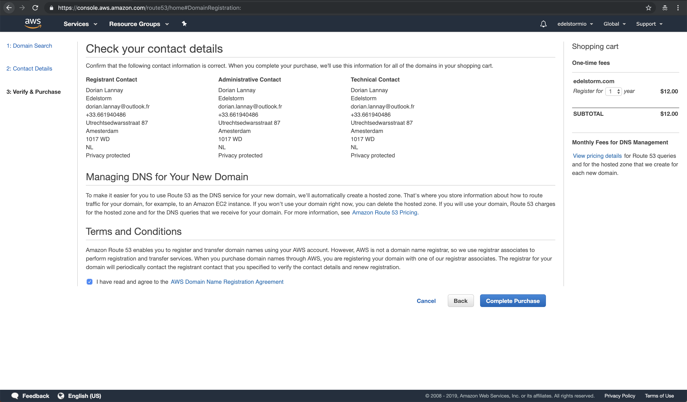
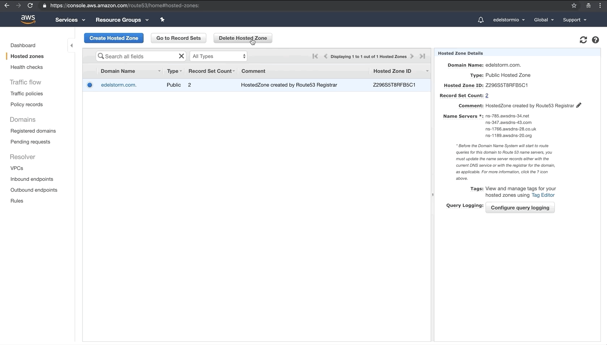

# Domain name - <small>AWS</small>

## Route 53

***

**<a href="/help/glossary/#domain-name" target="_blank">Domain name</a> system (DNS) in the cloud<a href="https://aws.amazon.com/fr/route53/" target="_blank">&#185;</a>**

:    * Select your ***geographic zone*** at the top right of the page.
:    * Type ***Route 53*** in the research bar, then click on the result.
:    * Choose the option on the right: {==Register domain name==}.

***

## Choosing a domain name

***

**Check the domain name availability**

:    * Type your ***domain name*** and choose an <a href="/help/glossary/#domain-name-extension" target="_blank">extension</a> for your future website. 
*The specified price is due annually.*

:    * Once you have chosen an available domain name, add it to the cart, then click on {==Continue==}.

***

## Contact details

***

**Fill out the contact form**

:    * Enable the protection of confidentiality.
:    * Click on {==Continue==}.

***

## Check your contact details

***

**Check your information**

:    * Check the box acknowledging that you have read the AWS Domain name registration agreement.
:    * Click on{==Complete purchase==}.

***

## Registration statuts

***

**Wait while AWS register your domain name**

:    * Registering your domain name can take up to 15 minutes. Take the time to stretch your legs.  🚶‍♀️ 🤸‍♀️
:    * Click on {==Registered domains==} on the left menu. Your domain name will appear when the registration is complete.

***

## Hosted zones

***

**Delete your default hosted zone**

:    * Once the domain name registered, click on {==Hosted zones==}.
:    * Select your ***domain name***, click on the third button {==Delete hosted zone==}, then on {==Confirm==}. 

!!! info "Deleting the default hosted zone will allow your future <a href="/help/glossary/#server" target="_blank">server</a> to take over."

***

!!! success "Congratulations, you have a registered domain name!"
    We will come back on last time on this page, so keep it open in a tab!