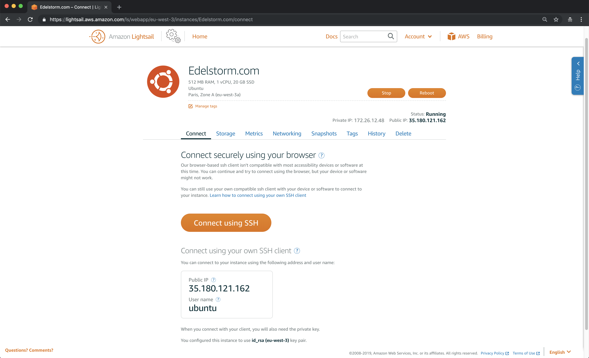
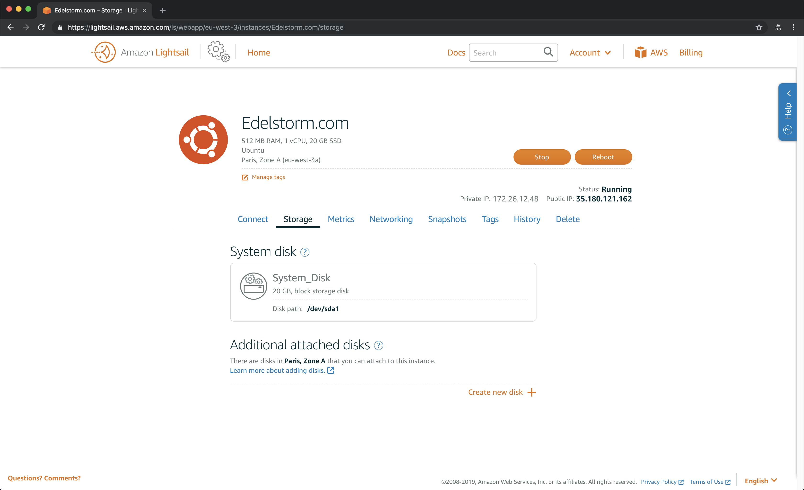
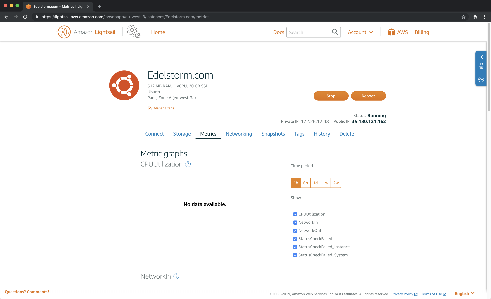
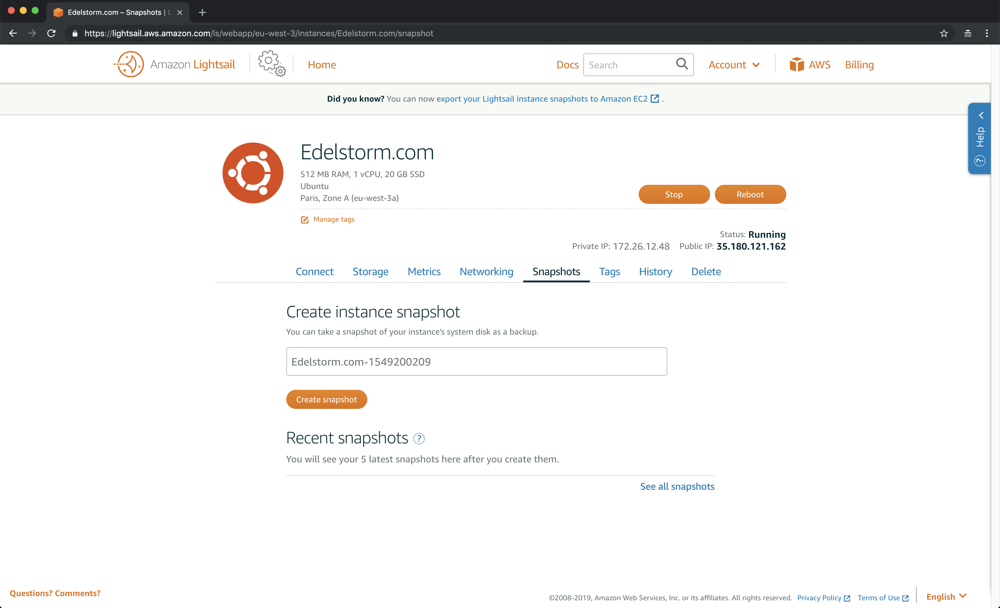
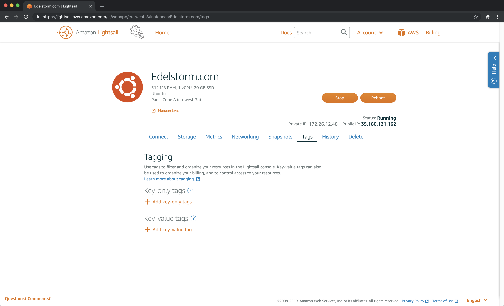
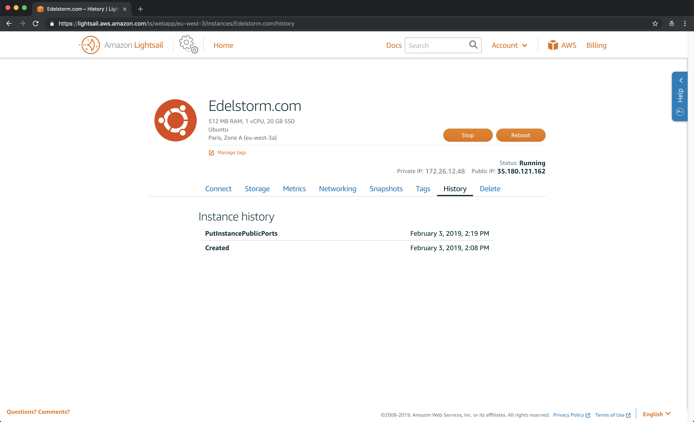
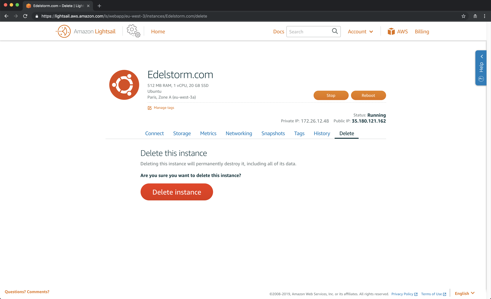

# Instance creation <small>- Lightsail</small>

!!! tip "Copy / paste the commands more easily by clicking on the icon on the right."

    ``` sh
    Copy this sentence to try.
    ```

## Generate an SSH key<a href="/help/glossary/#ssh"" target="_blank">&#185;</a>

<p><a href="../assets/images/aws/creation-instance/en/1.gif" target="_blank"></a></p>

***

**Securing communications between your computer and your future server**

:    * {==For the Mac users==} At the top right of your computer screen, click on the magnifier icon, start a Spotlight research. Type *Terminal* then hit <kbd>Enter</kbd>.
:    * {==For the Windows users==} Two ways depending on your OS version. 
        * In the *Start* menu, type *cmd* in the search bar. Select the first result (Command Prompt), by doing a right click and select the *execute as an administrator* mode.
        * Or, open your computer search bar from your desktop by hitting <kbd>⊞Win</kbd> then <kbd>S</kbd>. Then, type *cmd* in the research field. Select the first result (Command Prompt), by doing a click right and select the *execute as an administrator* mode.

:    * When you are on your terminal, type this command and hit <kbd>Enter</kbd>.
``` sh
ssh-keygen -t rsa
```

:    * You can now name your keys, then press <kbd>Enter</kbd>.
:    * A little key appear on the terminal. It's time to choose a password {==(have a look at the note down below)==} and press <kbd>Enter</kbd>.
:    * Type your password again and press <kbd>Enter</kbd>.

!!! note "To keep in mind"

    When you type your password in a terminal, what you type will not appear on the screen. It's like your not typing, but you are!<br>
    So you will have to type it blindly.

***

<p><a href="../assets/images/aws/creation-instance/en/2.gif" target="_blank"></a></p>

***

**Tracking your SSH key<a href="/help/glossary/#ssh"" target="_blank">&#185;</a>**

{==For Mac computers==} 
:    * Open your Finder, click on the top menu and choose **Go**, then click on **Go to file...**
:    * In the search bar, type this command and hit <kbd>Enter</kbd>.
``` sh
~/.ssh
```

:    * Once you are in the file {==.ssh==}, drag the file icon you can see at the top of the Finder windows, on your favorites. This will make it more easy for you to access it for the next step.

{==For Windows computers==} 
:    * 
:    * 

!!! success "Your computer generated SSH keys that you can find easily from its file!"

***

## Instance creation

<iframe width="100%" height="405" src="https://www.youtube-nocookie.com/embed/NG6jjPI0bRg?rel=0" frameborder="0" allow="accelerometer; autoplay; encrypted-media; gyroscope; picture-in-picture setPlaybackQuality(hd1080);" allowfullscreen></iframe>

***

**Amazon Lightsail instance options**

:    * **Go on your web navigator**. You should still have the AWS hosted zone page open (see last step <a href="/domain-name/" target="_blank">Domain name</a>). <br>
Do a **Richt clic on the AWS logo** at the right and open in a new tab.

:    * You now are on your AWS management console. Search for the service *Lightsail* and click on it.
:    * Choose the language you prefer to use.
:    * Click on {==Create instance==}.
:    * **Choose an instance location**. Choose the region that is the closest to where your future users will be located.<br> 
        *If you target users in Europe, you can choose Frankfurt, if you target users in Japan, you should choose Tokyo. The goal is to enable a quicker loading of your website to the users.*
:    * Let the Availability Zone by default.
:    * Choose *Linux/Unix* as a platform.
:    * In *Select a blueprint*, click on the tab *OS Only* and choose *Ubuntu 16.04 LTS* as an operating system.
:    * Don't add any shell script (to read more about it <a href="/help/glossary/#shell-script" target="_blank">click here</a>).
:    * Click on *Change SSH key pair* and on *Upload New* then on {==Upload==}. 
:    * Click on *Choose a file* and choose `id_rsa.pub` file in your `~/.ssh` folder, then click on {==Upload key==}. <br>
*It can take some time to load*<br>
*Providing your public SSH key will enable you to secure the communication between your computer and your Amazon Lightsail instance.*

:    * Select the basic **3.50$ per month** plan, the first trial month is free.
:    * Name your instance, with your <a href="/help/glossary/#domain-name" target="_blank">domain name</a> preferably.
:    * You can add identifications tags to this instance if you think you are going to create other instances in the future.
:    * Click on {==Create an instance==} and wait a moment that your instance to initialize.

!!! info "Informations"

    From now you subscribe to the Amazon Lighsail service. You can delete this instance at any moment. You can check the billing from <a href="https://console.aws.amazon.com/billing/home#/" target="_blank">here</a>.

!!! success "Your Amazon Lightsail instance is now ready to be used for your website."

***

## Firewall & Static IP

<iframe width="100%" height="405" src="https://www.youtube-nocookie.com/embed/aBRPNBX_XMc?rel=0" frameborder="0" allow="accelerometer; autoplay; encrypted-media; gyroscope; picture-in-picture setPlaybackQuality(hd1080);" allowfullscreen></iframe>

***

**Opening of the HTTPS & FTP ports**

:    * You instance logo has changed from gray to orange. It is ready to get used!
:    * Click on your instance and go to the ***Networking*** section.
:    * Scroll dpwn to the *Firewall* section, click on ***Add another***.
:    * In the *Custom* field, click on the dropdown menu and select ***HTTPS***.<br>
        *This will secure the communications between your users the external applications and your instance. <a href="/help/glossary/#https" target="_blank">Click here to know more more about https</a>.*
:    * Click on ***Add another***.
:    * Write ***34210*** to the *Port* field ad that's it. 
:    * Click on {==Save==}.

***

**Dynamic IP fixation**

:    * Scroll up ad click on {==Create static IP==}.
:    * The static IP location should be the same as your instance.
:    * In *Identify your static IP*, name your static IP this way, with YOUR domain name: *StaticIp-YourDomainName*.
:    * Click on {==Create==}.

!!! info "Dynamic IP and static IP"

     By default, your instance has a dynamic IP. Meaning that each time you restart your instance, your IP address changes. You need a static IP so your website is reachable from a unique address. A <a href="/help/glossary/#static-ip" target="_blank">static IP</a> is free when it is linked to an instance.

!!! success "The HTTPS and FTP ports are now opened and the instance has a static IP."

***

## DNS zone

<iframe width="100%" height="405" src="https://www.youtube-nocookie.com/embed/SL4oC8wznzI?rel=0" frameborder="0" allow="accelerometer; autoplay; encrypted-media; gyroscope; picture-in-picture setPlaybackQuality(hd1080);" allowfullscreen></iframe>

**Combination of your instance and domain name**

:    * On the top left corner, click on ***Home*** then go to the ***Networking*** tab.
:    * Click on {==Create DNS zone==}.  <a href="/help/glossary/#dn-zones" target="_blank">Click here to know more about the DNS Zone</a>.
:    * In the field, write your domain name.
:    * You can add identifications tags to this DNS zone if you think you will create more than one.
:    * Click on {==Create DNS zone==}.

***

**Creation of DNS records**

:    * Click on ***Add record***.
:    * Add a first type A record for `@.YourDomainName.com` pointing to your static IP. <br><br>
       **To do so**, type <kbd>@</kbd> on the first field on the left. Then select the static IP you just created on the right. Click on the ***green icon*** to save.
:    * Click on ***Add record*** again.
:    * Add a second type A for `www.YourDomainName.com` pointing to your static IP.<br><br>
       **To do so**, type <kbd>www</kbd> on the first field on the left. Then select the static IP you just created on the right. Click on the ***green icon*** to save.

!!! success "Your instance has a DNS zone and its static IP point to your domain name."

***


## Nameservers

<iframe width="100%" height="405" src="https://www.youtube-nocookie.com/embed/uVV-diKCHcM?rel=0" frameborder="0" allow="accelerometer; autoplay; encrypted-media; gyroscope; picture-in-picture setPlaybackQuality(hd1080);" allowfullscreen></iframe>

***

**Adding new nameservers for your domain name**

:    * Under the DNS records, you can see the *Nameservers*.
:    * Go back on the *Route 53* page you left open.<br>
If you closed it then do a right click on ***AWS***, at the top right corner. Then, search for *Route 53* in the search bar and click on it.

:    * On the left side of the interface, click on ***Registered domains***.
:    * Click on your ***domain name***.
:    * On the right, click on ***Add or edit name servers***.<br> 
Then, you have to replace the actuals name servers by the four new ones from your DNS zone (on the page you just left), one by one.

:    * Click on {==Update==}.

!!! success "Your DNS nameservers now match your domain name."

***

## Instance options

!!! info "Overview"

    You just created your first instance. By clicking on its name from the Lightsail homepage you will discover that you have some options at your disposal. We are going to tell you about it.

<p><a href="../assets/images/aws/creation-instance/en/3.png" target="_blank"></a></p>

***

**SSH connexion from your browser**

:    * In the *Connect* tab, by clicking on *Connect using SSH* you can access in a secure way at your server through a terminal.
:    * You can choose to connect to, stop, restart or delete this instance.
:    * You can use your static IP and your domain name displayed here if you want to connect to your SSH directly from your computer.

!!! info "<a href="/help/glossary/#ssh" target="_blank">CLick here</a> to learn more about the SSH."

***

<p><a href="../assets/images/aws/creation-instance/en/4.png" target="_blank"></a></p>

***

**Storage**

:    * In the *Storage* tab, with the 3.50$ per month plan, you beneficiate of 20Go storage on this instance. Which is enough for your currents needs.
:    * If you need more storage space, you can add storage discs to this instance. Adding new discs in a paying service.

***

<p><a href="../assets/images/aws/creation-instance/en/5.png" target="_blank"></a></p>

***

**Metrics**

:    * In the *Metrics* tag, you can get statistics on what you do with your instance.

***

<p><a href="../assets/images/aws/creation-instance/en/6.png" target="_blank"></a></p>

***

**Snapshots**

:    * The *Snapshots* tab is a very important functionality. We will talk more about it later, but basically, it allows you to save your instance and its content when you want it. It will allow you to come back to an earlier version of your instance (and your website so) if you make a mistake.

***

<p><a href="../assets/images/aws/creation-instance/en/7.png" target="_blank"></a></p>

***

**Tags**

:    * You can add tags to your instance to identify it more easily if you have several ones.
***

<p><a href="../assets/images/aws/creation-instance/en/8.png" target="_blank"></a></p>

***

**History**

:    * You can consult the history of your last actions on this instance.

***

<p><a href="../assets/images/aws/creation-instance/en/9.png" target="_blank"></a></p>

***

**Delete**

:    * At any time, you can delete your instance through this tab.

***

!!! success "Congratulation your instance is now configured for your website!"