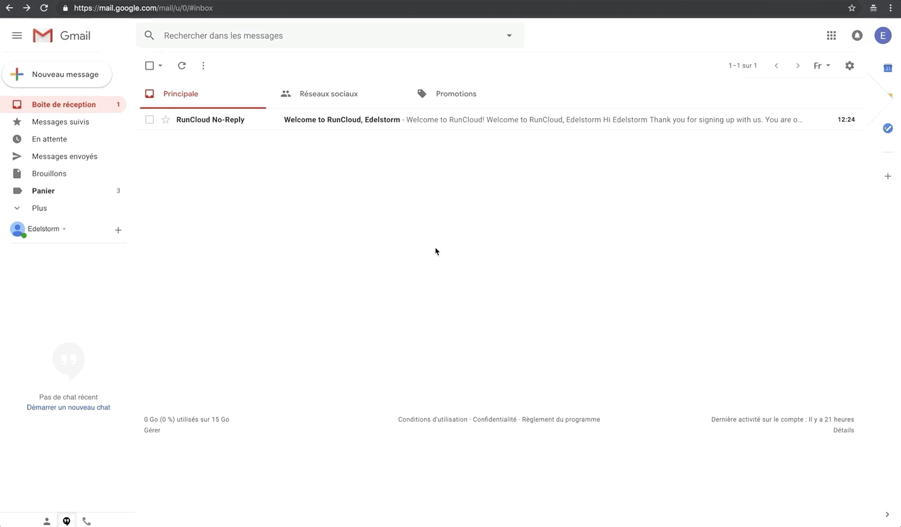

# Run Cloud <small>- AWS</small>

## Création du compte

!!! info "Runcloud.io"

    Runcloud est un service vous permettant de déployer des applications PHP facilement et en toute sérénité. Le but de cette étape est de connecter votre instance Lightsail à l'interface Runcloud.io pour y installer et configurer Wordpress.

<p><a href="../assets/images/aws/run-cloud/1.gif" target="_blank"></a></p>

***

**Rendez-vous sur le site web de <a href="https://runcloud.io/" target="_blank">RunCloud.io</a>**

:    * Cliquez sur {==Sign Up==} en haut à droite.
:    * Remplissez le formulaire et cliquez sur {==Create Free Account==}.

***

<p><a href="../assets/images/aws/run-cloud/2.gif" target="_blank"></a></p>

***

:    * Confirmez votre compte en cliquant sur {==Verify Registration==} dans l'e-mail que vous avez reçu.
:    * Connectez-vous à votre compte avec vos identifiants en cliquant sur {==Sign in to Dashboard==}.

!!! success "Vous venez de créer un compte Runcloud.io !"

***

## Installation

<iframe width="100%" height="405" src="https://www.youtube-nocookie.com/embed/60g3llUqnAo?rel=0" frameborder="0" allow="accelerometer; autoplay; encrypted-media; gyroscope; picture-in-picture setPlaybackQuality(hd1080);" allowfullscreen></iframe>

***

**Installation de Runcloud sur votre instance Lightsail**

:    * Fermez la fenêtre *Route 53*.
:    * Sur la page *Amazon Lightsail* cliquez sur ***Accueil***.
:    * Copier l'adresse IP de votre serveur. C'est la suite de chiffre se trouvant dans l'encart gris représentant votre instance.
:    * Retournez sur votre ***tableau de bord Runcloud***.
:    * Cliquez sur ***Connect a New Server***.
:    * Dans le premier champ, nommez votre serveur avec le nom de votre site web.
:    * Copiez/collez l'IP statique de votre instance Lightsail dans le deuxième champ.<br>
*Vous la trouverez sur votre page Lightsail, à côté du nom de votre instance.*

:    * Puis, inscrivez ***AWS*** comme Server Provider dans le troisième champ.
:    * Cliquez sur {==Connect this server==}.
:    * *RunCloud.io va générer une commande d'installation pour votre serveur.* Copiez-là en cliquant sur ***l'icône vert*** à droite de la commande.
:    * Revenez sur Lightsail et connectez-vous en SSH à votre instance en cliquant sur les ***trois petits points*** à coté du nom de votre instance. Puis cliquez sur ***Connexion***.
:    * Une fois à l'intérieur du terminal de votre serveur, tapez directement la commande ci-dessous pour obtenir les droits administrateurs et appuyez sur <kbd>Entrer</kbd>.
``` sh
sudo su
```

:    * Cliquez sur ***l'icône orange*** en bas à droite de la fenêtre du terminal et collez la commande copiée précédemment à l'intérieur.
:    * Cliquez ensuite sur la partie noire du terminal, faites un clic droit pour coller la commande à l'intérieur et appuyez sur <kbd>Entrer</kbd>.

!!! warning "Installation"

    La commande va alors installer Runcloud avec l'ensemble des configurations nécessaires à son fonctionnement. Surtout, **NE QUITTEZ PAS** le terminal avant la fin du processus qui dure une dizaine de minutes. 

***
    
<iframe width="100%" height="405" src="https://www.youtube-nocookie.com/embed/cwFqsujueXo?rel=0" frameborder="0" allow="accelerometer; autoplay; encrypted-media; gyroscope; picture-in-picture setPlaybackQuality(hd1080);" allowfullscreen></iframe>

***

**Sauvegarde de vos accès MySQL<a href="/aide/glossaire/#mysql" target="_blank">&#185;</a>**

:    *  Une fois l'installation terminée des ***passwords*** (mots de passe) MySQL de votre base de données s'affichent sur la console. Pensez impérativement à les copier puis coller dans un fichier sécurisé sur votre ordinateur ! 

:    *  Pour copier/coller sur le terminal, il vous suffit de sélectionner ce que vous voulez copier, puis de cliquer sur l'icône orange en bas à droite. Vous y retrouverez ce que vous venez de sélectionner, vous pouvez alors, à partir de cet endroit, copier le contenu.

:    *  Ouvrez un fichier texte pour y stocker vos accès MySQL, sauvegardez-le ensuite dans un endroit sécurisé.<br>
*<a href="/aide/glossaire/#mysql" target="_blank">Cliquez ici</a> pour en savoir plus sur MySQL.*

!!! success "Vous avez maintenant accès à l'interface d'administration de votre instance Runcloud.io."

***

## Création de l'application

<iframe width="100%" height="405" src="https://www.youtube-nocookie.com/embed/QZWbIUgD3fI?rel=0" frameborder="0" allow="accelerometer; autoplay; encrypted-media; gyroscope; picture-in-picture setPlaybackQuality(hd1080);" allowfullscreen></iframe>

***

**Revenez sur Runcloud.io, vous devriez avoir accès à votre interface d'administration**

:    * Dans le menu de gauche, cliquez sur {==Web Application==}.
:    * Cliquez sur {==Create Application==}.
:    * Remplissez le formulaire en commençant par nommer votre application avec le nom de votre futur site web.
:    * Ajoutez le nom de domaine de votre site de cette façon :
``` sh
*.VotreNomDeDomaine.com
```

:    * Choisissez l'utilisateur par défaut *Runcloud*.
:    * Laissez le chemin public, *Public Path*, par défaut.
:    * Dans le menu déroulant, sélectionnez la version de PHP la plus avancée disponible.
:    * Sélectionnez ***NGINX + Apache2 Hybrid (You will be able to use .htaccess)***.
:    * Choisissez le mode ***Production***.
:    * Cochez case *Advanced Settings*.
:    * Descendez la page jusqu'à atteindre le champ : *MAX_EXECUTION_TIME*. <br>
Écrivez ***300*** dans ce champ, en remplaçant son contenu actuel. 

:    * Puis dans le champ *MAX_EXECUTION_TIME*., remplacez le nombre actuel par ***3000***.

:    * Descendez jusqu'en bas de la page et cliquez sur le bouton {==Add Web Application==}.

!!! success "Un espace permettant d'accueillir une application est désormais disponible sur votre instance Lightsail."

***

## Configurations

<iframe width="100%" height="405" src="https://www.youtube-nocookie.com/embed/dXBSFrl6MYg?rel=0" frameborder="0" allow="accelerometer; autoplay; encrypted-media; gyroscope; picture-in-picture setPlaybackQuality(hd1080);" allowfullscreen></iframe>

***

**Installation de Wordpress**

:    * Dans le menu de gauche, cliquez sur {==Script Installer==}.
:    * Dans le menu déroulant, sélectionnez le script ***Wordpress***.
:    * Cliquez sur {==Install==}.

***

**Configuration du nom de domaine**

:    * Dans le menu de gauche, cliquez sur {==Domain Name==}.
:    * Ajoutez votre nom de domaine sous cette forme : `www.exemple.com` dans le champ.
:    * Cliquez sur {==Attach Domain Name==}.
:    * Ajoutez votre nom de domaine sous cette forme : `exemple.com`, dans le champ.
:    * Cliquez sur {==Attach Domain Name==}.

!!! warning "Attention, la prochaine  étape n'est à réaliser que si vous avez créé un sous-domaine lors de <a href="/creation-de-l'instance/#zone-dns" target="_blank">l'étape zone DNS</a>."
:    * Ajoutez votre nom de domaine avec son sous-domaine sous cette forme : `SousDomaine.exemple.com`, dans le champ.
:    * Cliquez sur {==Attach Domain Name==}.


***

**Création du certificat de sécurité SSL**

:    * Dans le menu de gauche, cliquez sur {==SSL/TLS==}.
:    * Descendez la page, cochez la cache *Enable HSTS*.
:    * Sélectionnez ***Let's Encrypt*** comme méthode SSL.
:    * Sélectionnez ***Http-01*** comme méthode d'autorisation.
:    * Sélectionnez ***Live*** comme environnement.
:    * Cliquez sur {==Submit==}.
:    * Cliquez sur {==Create Let's Encrypt Request==}.

!!! success "Wordpress est installé sur votre instance Lightsail, la configuration du nom de domaine est correcte et votre certificat de sécurité SSL est activé."

***

## Base de données

<iframe width="100%" height="405" src="https://www.youtube-nocookie.com/embed/8DdfF7XL5Ug?rel=0" frameborder="0" allow="accelerometer; autoplay; encrypted-media; gyroscope; picture-in-picture setPlaybackQuality(hd1080);" allowfullscreen></iframe>

***

**Création de la base de données**

:    * Revenez à l'accueil en cliquant sur ***Back to web apps*** à gauche.
:    * Dans le menu de gauche, cliquez sur {==Database==}.
:    * Cliquez sur ***Create Database***.
:    * Nommez votre base de données comme vous le souhaitez. Le nom de votre site est une bonne option.
:    * Laissez le champ *Collation* vide par défaut.
:    * Cliquez sur {==Add Database==}. 

!!! info "Information"

    Pour fonctionner, votre application (Wordpress) a besoin d'une base de données dans laquelle l'ensemble du site web et des informations de vos utilisateurs seront stockés.

***

**Création de l'administrateur de la base de données**

:    * Cliquez sur ***Create Database User***.
:    * Dans *Database User* créez votre identifiant, **stockez cette information dans un fichier et sauvegardez-le dans un endroit sécurisé** !
:    * Générez votre mot de passe et **copiez le** ! **Stockez cette information dans un fichier et sauvegardez-le dans un endroit sécurisé**!
:    * Cliquez sur ***Add Database User***.

!!! info "Information"
    
    Pour accéder à l'interface d'administration de Wordpress, il vous faut un compte administrateur qui aura les droits d'accès à la base de données. Sauvegardez impérativement ces informations dans un fichier et sauvegardez-le dans un endroit sécurisé !

<!-- ***

**Association du compte administrateur à la base de données**

:    * Cliquez sur ***Attach User***.
:    * Sélectionnez l'utilisateur administrateur dans la liste déroulante.
:    * Cliquez sur ***Attach User***.

!!! success "Une base de données lié à un administrateur est disponible pour Wordpress." -->

***

## Installation de services

<iframe width="100%" height="405" src="https://www.youtube-nocookie.com/embed/FjCZo9eb1Yk?rel=0" frameborder="0" allow="accelerometer; autoplay; encrypted-media; gyroscope; picture-in-picture setPlaybackQuality(hd1080);" allowfullscreen></iframe>

***

**Activation services sur Runcloud**

:    * Dans le menu de gauche, cliquez sur {==Services==}.
:    * Descendez un peu la page et cliquez sur l'***icône de réglages*** à coté du logo de **Redis**.
:    * Cliquez sur ***Start***, puis sur le bouton {==Start==}.
:    * Cliquez sur l'***icône de réglages*** à coté du logo de **Memcached**.
:    * Cliquez sur ***Start***, puis sur le bouton {==Start==}.
:    * Cliquez sur l'***icône de réglages*** à coté du logo de **Beanstalkd**.
:    * Cliquez sur ***Start***, puis sur le bouton {==Start==}.

!!! success "Redis est maintenant actif sur votre application Runcloud."

***

## Clé SSH

<iframe width="100%" height="405" src="https://www.youtube-nocookie.com/embed/EovF2HXPruE?rel=0" frameborder="0" allow="accelerometer; autoplay; encrypted-media; gyroscope; picture-in-picture setPlaybackQuality(hd1080);" allowfullscreen></iframe>

***

**Configuration de votre clé SSH publique pour Runcloud.io**

:    * Dans le menu de gauche, cliquez sur {==SSH Key==}.
:    * Cliquez sur {==Add SSH Key==}.
:    * Ajoutez un nom à votre clé SSH publique dans le champ *Label*.
:    * Allez dans votre dossier `.ssh`.
:    * Ouvrez avec un éditeur de texte votre clé publique `id_rsa.pub`.
:    * Copiez la clé et collez là dans le champ *Public Key* de Runcloud.io
:    * Cliquez sur {==Add==}.

!!! success "Votre clé SSH publique est disponible, vous pourrez vous connecter à distance sur votre serveur dans Runcloud.io."

***

## Configurations Wordpress

<iframe width="100%" height="405" src="https://www.youtube-nocookie.com/embed/mqCtL375GDY?rel=0" frameborder="0" allow="accelerometer; autoplay; encrypted-media; gyroscope; picture-in-picture setPlaybackQuality(hd1080);" allowfullscreen></iframe>

***

**Association de la base de donnnées à Wordpress**

:    * Dans le menu de gauche cliquez sur ***Web application***.
:    * À droite sur le tableau, cliquez sur l'{==icone rouage==} de la colone *Options*. 
:    * Sélectionnez ***Set as default Web Application*** puis cliquez sur le bouton {==Set As Default==}.

!!! info "Accéder à votre site web" 
    Vous pouvez maintenant accéder à votre site ! <br>Tapez votre nom de domaine `https://exemple.com` dans la barre d'adresse URL  de votre navigateur, vous verrez alors la page d'installation classique de Wordpress.

:    * Sélectionnez la ***langue*** de votre choix.
:    * Cliquez sur {==Continuer==} puis sur {==C'est parti !==}.
:    * Entrez le ***nom de votre base de données*** Runcloud.io (nous l'avons défini lors de l'étape <a href="/run-cloud-fr/#base-de-donnees" target="_blank">Base de données</a>).
:    * Entrez le ***nom d'administrateur de votre base de données*** Runcloud.io (nous l'avons égalemnt défini lors de l'étape <a href="/run-cloud-fr/#base-de-donnees" target="_blank">Base de données</a>).
:    * Entrez le ***mot de passe de votre base de données*** Runcloud.io, que vous avez précedemment sauvegardé dans un fichier (nous l'avons aussi défini lors de l'étape <a href="/run-cloud-fr/#base-de-donnees" target="_blank">Base de données</a>).
:    * Laissez par défaut *Database Host* à `localhost`.
:    * Changez les lettres de votre préfixe de table par quelque chose d'autre que `wp_`, tout en gardant ce format.
:    * Cliquez sur {==Envoyer==}.
:    * Cliquez sur {==Lancer l'installation==}.

***

**Informations du site et création de l'utilisateur administrateur**

!!! info "Identifiants à retenir !" 
    Pour cette étape, vous allez créer les accès administrateur à votre site Wordpress. **Conservez absolument ces informations dans un endroit sécurisé !**

:    * Donnez un ***titre*** à votre site web.
:    * Définissez votre ***nom d'utilisateur***, stockez cette information dans un fichier et sauvegardez-le dans un endroit sécurisé !
:    * Générez un ***mot de passe***, copiez le et stockez cette information dans un fichier et sauvegardez-le dans un endroit sécurisé !
:    * Ajoutez votre ***adresse e-mail*** d'administrateur.
:    * Laissez la case *Visibilité pour les moteurs de recheche* décochée.
:    * Cliquez sur {==Install Wordpress==}.
:    * Vous pouvez désormais vous {==connecter==} à votre interface Wordpress.

!!! success "Vous avez maintenant accès à l'interface d'administration Wordpress de votre site web."